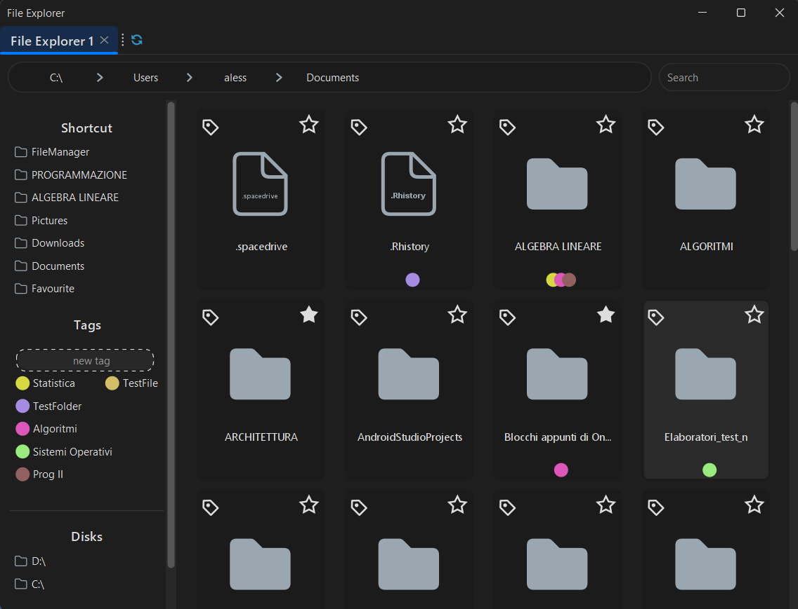

# FileManager

## Overview
This project is a Java-based application that provides a graphical user interface for viewing and managing files (file manager). The application uses Swing for the GUI and integrates with the FlatLaf look and feel for a modern appearance.


## Features
- File/Directory tags
- Add files/dir to favourite
- Drag and drop
  - Move multiple files/dirs in another directory
  - Add directory to shortcut 
  - drag and drop selection
- Glob pattern searching
- Multi tabs
- Clouds shortcut

## TODOs
- [ ] Contextual popup menu
- [ ] Improving shortcut
- [ ] Shortcut buttons for actions:
  - open terminal
  - vscode
  - ...
- [ ] Improving speed and background tasks
- [ ] Create tests
- [ ] 

## Technologies Used
- Java
- Swing
- FlatLaf
- SQLite
- Maven

### Prerequisites
- Java Development Kit (JDK) 8 or higher
- Maven
- SQLite drivers

### Installation
1. Clone the repository:
    ```sh
    git clone https://github.com/alessio-vivaldelli/FileManager
    ```
2. Navigate to the project directory:
    ```sh
    cd FileManager
    ```
3. Build the project using Maven:
    ```sh
    mvn clean install
    ```

### Running the Application
1. Navigate to the `target` directory:
    ```sh
    cd target
    ```
2. Run the application:
    ```sh
    java -jar FileManager-1.0-SNAPSHOT.jar
    ```


## License
This project is licensed under the MIT License. See the `LICENSE` file for details.

## Acknowledgements
- [FlatLaf](https://www.formdev.com/flatlaf/)
- [MigLayout](http://www.miglayout.com/)
